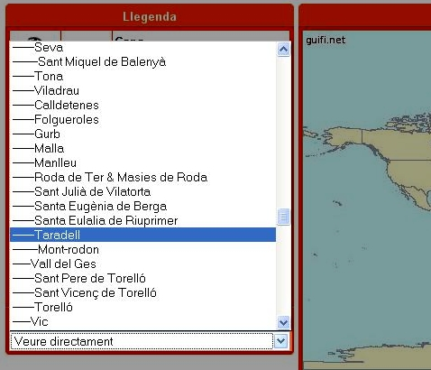



### Objectius

{: .lead }
En aquest pas veurem com fer l'alta d'usuari a guifi.net, com crear el nostre node, donar d'alta el trasto o router i generar l'unsolclic.

### Procediments

Tot comença per obrir el nostre navegador i visitar la pàgina de **guifi.net**. El primer que hem de fer és l'alta d'usuari per tal de crear el nostre usuari dins la comunitat de guifi.net.

{: .text-center}
{: .img-responsive .img-thumbnail}

Per poder crear un nou usuari, cliquem a l'enllaç que posa ***crear un nou compte d'usuari***, que trobarem al menú lateral.

{: .text-center}
{: .img-responsive .img-thumbnail}

Això ens portarà a la pàgina **el meu perfil**, on haurem d'omplir les nostres dades personals.

{: .text-center}
{: .img-responsive .img-thumbnail}

- *Usuari*: nom amb què ens identificarem a guifi.net
- *Adreça de correu*: adreça de correu electrònic per poder contactar amb vosaltres
- *Poble o ciutat*: El poble d'on sou...
- *Regió, província o comarca*: La província d'on sou...
- *Zip or postal code*: el codi postal del vostre poble o ciutat (OPCIONAL)
- *URL of homepage*: la direcció de la vostre pàgina web, blog, el-que-sigui (OPCIONAL)
- *Biography*: La vostre biografia...(TOTALMENT OPCIONAL!!!&nbsp; :P )
- *Interests*: Què us agrada? (OPCIONAL)

Un cop s'ha omplert tota la informació premem al botó ***crear un nou compte d'usuari***

{: .text-center}
{: .img-responsive .img-thumbnail}

Ja tenim creat el nostre usuari!!!. Si ens fixem, al menú lateral on posava crear un nou compte d'usuari, ara apareix el nostre nom d'usuari i unes quantes opcions.

{: .text-center}
{: .img-responsive .img-thumbnail}

Ara ja podem anar per crear el nostre node. El node no és res més que la informació d'on farem l'enllaç, cap a on ens connectarem i de quina manera.

Per poder crear el node anem a l'apartat de ***mapes***, que trobarem al menú superior.

{: .text-center}
{: .img-responsive .img-thumbnail}

{: .alert .alert-info }
**Important!** Abans d'anar a l'apartat de mapes ens hem d'assegurar que hem entrat com a usuari, si no és així, escrivim el nostre nom d'usuari i contrasenya i premem el botó ***entreu.***

{: .text-center}
{: .img-responsive .img-thumbnail}

Després de clicar a mapes, ens apareixerà la següent pàgina. Aquesta pàgina ens mostra tots els enllaços, punts d'accés, clients, que té la xarxa guifi.net.

{: .text-center}
{: .img-responsive .img-thumbnail}

El que hem de fer és localitzar la situació geogràfica del lloc on volem muntar el node ( és a dir, la teulada de casa nostre :P ). Per anar més ràpids podem seleccionar el nom del nostre poble al desplegable que hi ha a l'esquerra.

{: .text-center}
{: .img-responsive .img-thumbnail}

Anem fent zoom fins que col·loquem l'estrelleta de color vermell sobre el lloc on anirà el node (la teulada...).

{: .text-center}
{: .img-responsive .img-thumbnail}

Un cop tenim localitzada la situació cliquem a l'enllaç que hi ha a sota del mapa, que diu ***afegir un node on hi ha l'estrella.*** Això ens portarà ala següent pàgina.

{: .text-center}
{: .img-responsive .img-thumbnail}

En aquesta pàgina hem de omplir les dades del nostre node.

- *Títol*: El nom del nostre node.
- *Nom curt*: El nom curt per accedir directament a la pàgina d'informació del node des de guifi.net.
- *Contacte*: correu electrònic de contacte, de la persona responsable del node (OPCIONAL).
- *Barri,zona*: Lloc on està situat el node (OPCIONAL).
- *Longitud i Latitud*: Les coordenades geogràfiques (NO CAL TOCAR RES!!!, ja les ha agafat del mapa anterior).
- *Descripció de la zona*: La direcció d'on hi ha el node (OPCIONAL).
- *Alçada de l'antena*: Alçada aproximada de l'antena des del terra (OPCIONAL).
- *Tens intenció de que sigui un node sempre connectat?*: Triem l'opció que més us convingui (Habitualment SI).
- *Cos*: Aquí podeu posar altres dades informatives de que disposarà el node (OPCIONAL).
