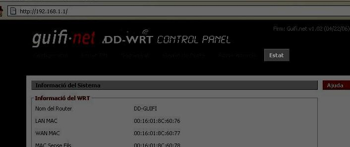
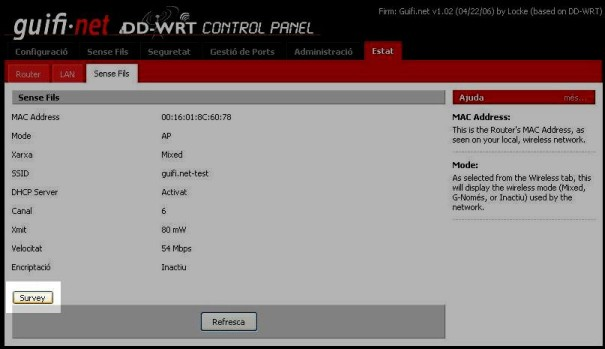
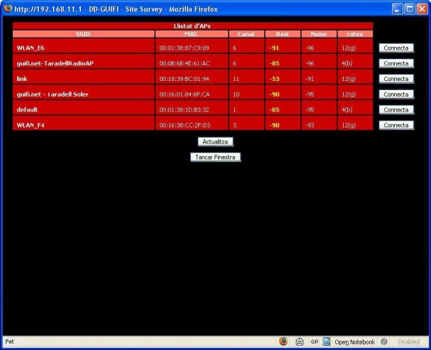
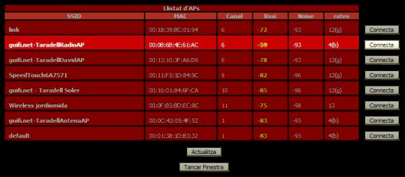
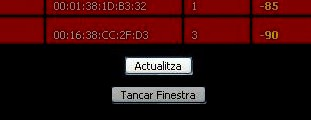

{: .lead }
Ara que ja tenim el nostre router modificat, ens cal buscar un punt d'accés per conectar-nos a la xarxa Guifi.net.

---

### Procediments

Partint de la pàgina principal del nou firmware (el DD-guifi).

{: .text-center}
{: .img-responsive .img-thumbnail}

Ara hem d'anar a l'apartat que s'anomena **Estat** que trobareu a la part superior dreta.

{: .text-center}
{: .img-responsive .img-thumbnail}

Un cop clicat, us demanarà autentificar-vos per accedir al router. Haurem d'escriure el nom *d'usuari* `root` i la *contrasenya* `admin`.

{: .text-center}
{: .img-responsive .img-thumbnail}

Si hem realitzat correctament la validació de l'usuari, ens apareixerà la pantalla d'Estat del router, on trobarem 3 noves pestanyes: **Router**, **Lan** i **Sense fils**.

{: .text-center}
{: .img-responsive .img-thumbnail}

Ara hem de clicar a la pestanya que diu **Sense fils**

{: .text-center}
{: .img-responsive .img-thumbnail}

Trobarem un botó a la part inferior esquerra anomenat **Survey**, que ens servirà per buscar els punts d'accés inal·làmbrics propers al nostre router.

{: .text-center}
{: .img-responsive .img-thumbnail}

Cliquem al botó **Survey** i ens apareixerà la següent pantalla a on se'ns presenta diversa informació en una espècie de graella anomenada **Llistat d'AP's**.

{: .text-center}
{: .img-responsive .img-thumbnail}

Dins d'aquesta nova finestra, hem de buscar un punt d'accés que comensi per **"guifi.net-NOMUBICACIÓ"** i que els paràmetres de **RSSI** i **NOISE** siguin els recomanats. Entenem per valors recomanats els valors compresos entre el ***Valors aconsellats*** i el ***Valor mínim aconsellable*** de la taula següent:

{: .table .table-bordered }
| Camp | Valor aconsellat | Valor mínim aconsellable |
|:------:|:------:|:------:|
| RSSI   | ~ -75  | > -85  |
| NOISE  | -100   | < -95  |

{: .alert .alert-info }
**Atenció** cal tenir en compte que els valors negatius del RSSI poden portar a la confusió, ja que al ser en escala negativa, un -75 seria més gran (i millor) que un -85. Igual passa amb el NOISE, que ha de ser com més proper a -100 millor.

En el nostre cas, el punt d'accés seleccionat (AP) es "guifi.net-TaradellRadioAP" perquè obtenim uns valors de RSSI de -59 i NOISE de -93.

{: .text-center}
{: .img-responsive .img-thumbnail}

En cas que obtenim uns valors molt dolents (RSSI ~ -90 i/o NOISE ~ -80) o no trobar cap AP de guifi.net, haurem de re-orientar l'antena i clicar on hi ha el botó de **Actualitzar**.

{: .text-center}
{: .img-responsive .img-thumbnail}

Un cop ja sabem a on connectar, anem a la web de Guifi.net a donar d'alta el nostre node per tal de situar el nostre node i realitzar la configuració del router.

### Què hem vist?

En aquest fragment de la guia hem après a:

1. Buscar un punt d'accés per connectar-se a la xarxa guifi.net.
