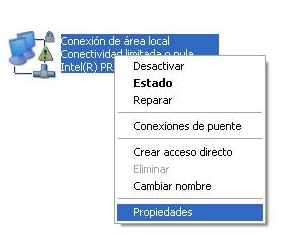
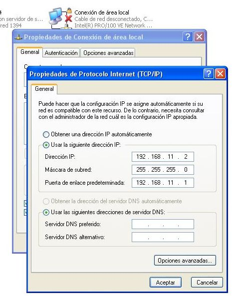
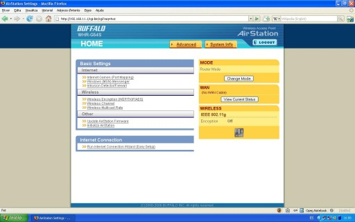
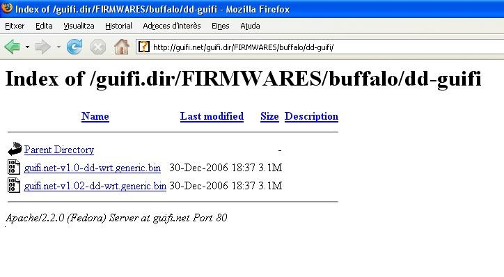
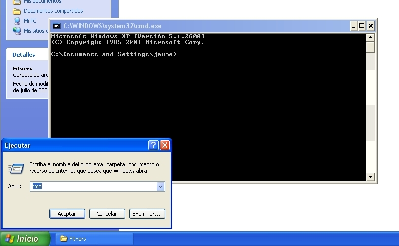
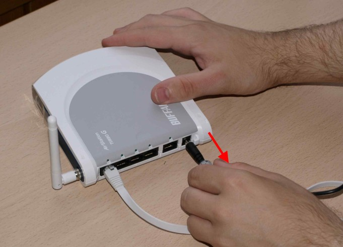
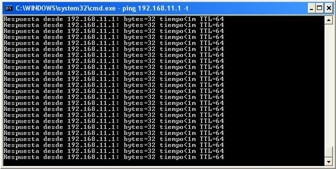

{: .lead }
En aquest pas veurem com modificar el firmware del nostre router per tal de poder-nos connectar a la xarxa de guifi.net.

---

{: .alert .alert-info }
**Abans de començar** Com que hem de treballar sobre el nostre router, el treiem de la caixa estanca i anem a un lloc més còmode per facilitar el treball.

{: .alert .alert-danger }
**Avís important** La modificació del firmware comporta uns riscos, tals com la inutilització del router si no es realitza correctament. Es aconsellable que aquest pas es realitzi saben els que es fa i seguint al peu de la lletra els passos que venen a continuació. En cas de dubte i/o por a inutilitzar el router deixeu que algú amb experiència en el tema us doni un cop de mà. Els autors de la guia no es responsabilitzen dels danys que pugui patir el vostre router.

Connectem el router amb el transformador i l'endollem. Agafem el cable de xarxa i el connectem, un extrem a l'ordinador i l'altre a un dels ports que té el router (en aquest cas el primer).

{: .text-center}
{: .img-responsive .img-thumbnail}

Ara hem de configurar l'interfície de xarxa del nostre ordinador per tal de poder comunicar-nos amb el router. Per això anem a l'apartat ***Conexiones de red*** del Windows, que trobarem al Panel de control.

{: .text-center}
{: .img-responsive .img-thumbnail}

Veurem varies icones, però només ens interessa la ***Conexión de area local***. Cliquem amb el botó dret del ratolí sobre de l'icona i seleccionem ***Propiedades***.

{: .text-center}
{: .img-responsive .img-thumbnail}

Dins de les *Propiedades de Conexión de area local*, seleccionem ***Protocolo Internet (TCP/IP)*** i cliquem ***Propiedades*** un altre cop.

{: .text-center}
"){: .img-responsive .img-thumbnail}

Aquí seleccionarem ***Usar la siguiente dirección IP*** i escriurem els següents camps:

- Dirección IP: 192.168.11.2
- Mascara de subred: 255.255.255.0
- Puerta de enlace: 192.168.11.1

{: .text-center}
{: .img-responsive .img-thumbnail}

Després cliquem ***aceptar*** i finalment ***cerrar***. En aquest punt, si teniu Windows XP, hauríeu d'observar un núvol informatiu a la part inferior dreta, informant-vos de que s'ha establert una connexió de xarxa.

{: .text-center}
{: .img-responsive .img-thumbnail}

Ara, si obrim el navegador web i entrem l'adreça `192.168.11.1`, ens apareixerà la pantalla inicial de configuració del router.

{: .text-center}
{: .img-responsive .img-thumbnail}

Tot i que aquest router disposa d'un apartat per actualitzar el firmware a través del web, no ens serveix, ja que els routers Buffalo tenen el firmware encriptat i això impedeix actualitzar el router si no és amb un firmware del fabricant.

Per aquest motiu farem servir un aplicatiu anomenat TFTP. Afortunadament no hem d'instal·lar cap programa ja que el Windows XP ja disposa del protocol TFTP de sèrie.

Abans però, necessitem descarregar el firmware que volem posar al nostre router.

Si anem a la pàgina [www.guifi.net/firmware][firmware] ens donarà unes recomanacions depenent del router que tinguem.

[firmware]: http://www.guifi.net/firmware "Pàgina d'informació dels firmwares"

{: .text-center}
{: .img-responsive .img-thumbnail}

En aquest cas (router Buffalo WHR-G54S) ens recomanen el DD-guifi o el DD-WRT. Triarem el DD-guifi i clicarem a l'enllaç. Ara ens apareixerà la pàgina amb els firmwares.

{: .text-center}
{: .img-responsive .img-thumbnail}

Clicarem a la versió més nova (guifi.net-v1.02-dd-wrt.generic.bin) i el guardarem al disc.

{: .text-center}
{: .img-responsive .img-thumbnail}

Ara que ens hem baixat el firmware, hem connectat el router i hem configurat la connexió de xarxa, ja ho tenim tot apunt per modificar-lo.

Com hem dit, els Buffalo necessiten ser actualitzats a través de TFTP. Per poder utilitzar-ho, anem a ***inicio*** &gt; ***ejecutar...*** escrivim `cmd` i cliquem ***Aceptar.*** Ens apareixerà una finestra de terminal.

{: .text-center}
{: .img-responsive .img-thumbnail}

Per poder veure l'estat de la connexió entre l'ordinador i el router durant els següents passos escrivim `ping 192.168.11.1 -t` a la finestra del terminal i premem *retorn* al teclat. Això ens anirà mostrant si hi ha resposta o no des de el router.

{: .text-center}
{: .img-responsive .img-thumbnail}

Ara obrim un altre terminal, anem a ***inicio*** & ***ejecutar...*** entrem `cmd` i cliquem ***Aceptar***. En aquest cas però anem a la carpeta on tenim guardat el firmware que ens hem baixat.

Com mostra la següent foto, ens trobem a la carpeta que conte el firmware *guifi.net-v1.02-dd-wrt.generic.bin*.

{: .text-center}
{: .img-responsive .img-thumbnail}

En aquesta nova finestra de terminal escrivim la següent comanda

Però no premem retorn encara!!!
{: .text-danger}

```
tftp -i 192.168.11.1 PUT guifi.net-v1.02-dd-wrt.generic.bin
```

{: .text-center}
{: .img-responsive .img-thumbnail}

Tot seguit, desconnectem el cable de corrent del nostre router.

{: .text-center}
{: .img-responsive .img-thumbnail}

Veurem que el primer terminal ens informa de que hi ha un *Error de hardware* a part de un missatge informatiu a la part inferior dreta que diu que el cable de xarxa està desconnectat.

{: .text-center}
{: .img-responsive .img-thumbnail}

Ara bé la part més complicada. **No us preocupeu si no us surt a la primera, és normal**. El pas consisteix en connectar el router a la corrent un altre cop i quan s'apaguin totes les quatre llumetes del router situades al darrere <i>premer retorn</i> al terminal on hem escrit allò de `tftp -i 192.168.11.1 PUT gufi.net-v1.02-dd-wrt.generic.bin.` Si tot va bé al cap d'uns segons apareixerà el missatge: ***Transferencia terminada: XXXXXXXX bytes en X segundos, XXXXX bytes/s***

Sinó apareixerà el missatge: ***Tiempo de espera agotado.***

{: .text-center}
{: .img-responsive .img-thumbnail}

Si no ha funcionat torneu a repetir la operació, prepareu la comada tftp en una terminal i desconecteu el router de la corrent. Al cap d'uns segons torneu a connectar el router a la corrent i premeu retorn al teclat. Així fins que tingueu èxit.

{: .alert .alert-info }
**Informatiu** si porteu varis intents fallits proveu la següent comanda, la qual registra l'adreça MAC del router al nostre ordinador i fa que pugui detectar l'aparell més ràpidament. \\
`arp -s 192.168.11.1 MAC-DEL-ROUTER`

{: .text-center}
{: .img-responsive .img-thumbnail}

Ara el router començarà a fer coses rares, notareu que el terminal que mostra l'estat de la connexió es connecta i es desconnecta.

{: .text-center}
{: .img-responsive .img-thumbnail}

A part també veureu que s'engeguen i es paren les llums del davant del router.

{: .text-center}
{: .img-responsive .img-thumbnail}

Tranquils, tot això és normal, el firmware que hem posat al router s'està instal·lant i per tant necessita reiniciar-se varis cops.

Al cap d'una estona veureu que el terminal que mostra l'estat de la connexió mostra tota l'estona ***Respuesta desde 192.168.11.1: Bytes32 tiempo&lt;1m TTL=64.***

{: .text-center}
{: .img-responsive .img-thumbnail}

Això vol dir que el router ja està llest per tornar-lo a col·locar i connectar al lloc definitiu que hem muntat al primer punt.

Si ara obrim el navegador web i escrivim `192.168.11.1` ens apareixerà una pàgina diferent a la que havíem vist anteriorment. Aquesta és la pàgina principal del nou firmware (el DD-guifi).

{: .text-center}
{: .img-responsive .img-thumbnail}

### Què hem vist?

En aquest fragment de la guia hem après a:

1. Descarregar el firmware per al nostre router de la pàgina de guifi.net.
2. Modificar el firmware del router.

