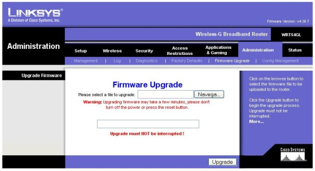
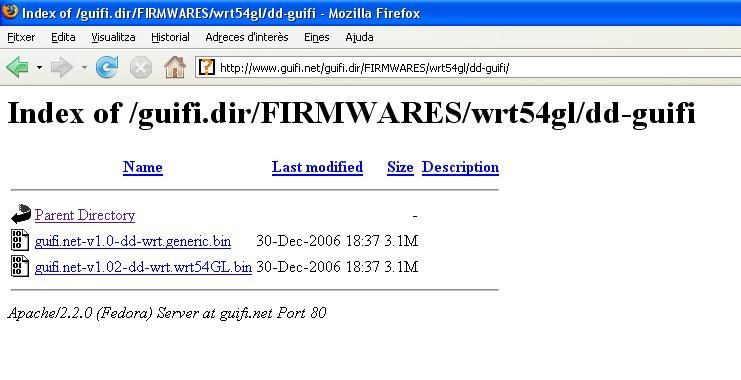
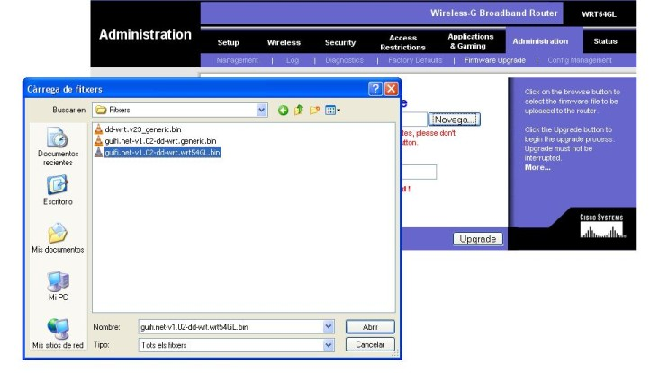

{: .lead }
En aquest pas veurem com modificar el firmware del nostre router per tal de poder-nos connectar a la xarxa de guifi.net.

---

{: .alert .alert-info }
**Abans de començar** Com que hem de treballar sobre el nostre router, el treiem de la caixa estanca i anem a un lloc més còmode per facilitar el treball.

{: .alert .alert-danger }
**Avís important** La modificació del firmware comporta uns riscos, tals com la inutilització del router si no es realitza correctament. Es aconsellable que aquest pas es realitzi saben els que es fa i seguint al peu de la lletra els passos que venen a continuació. En cas de dubte i/o por a inutilitzar el router deixeu que algú amb experiència en el tema us doni un cop de mà. Els autors de la guia no es responsabilitzen dels danys que pugui patir el vostre router.

### Procediments

Connectem el router amb el transformador i l'endollem. Agafem el cable de xarxa i el connectem, un extrem a l'ordinador i l'altre a un dels ports que té el router (en aquest cas el primer).

{: .text-center}
{: .img-responsive .img-thumbnail}

Ara hem de configurar l'interfície de xarxa del nostre ordinador per tal de poder comunicar-nos amb el router. Per això anem a l'apartat ***conexiones de red*** del windows, que trobarem al Panel de control.

{: .text-center}
{: .img-responsive .img-thumbnail}

Veurem varies icones, però només ens interessa la ***Conexión de area local***. Cliquem amb el botó dret del ratolí sobre de l'icona i seleccionem ***Propiedades***.

{: .text-center}
{: .img-responsive .img-thumbnail}

Dins de les *Propiedades de Conexión de area local*, seleccionem ***Protocolo Internet (TCP/IP)*** i cliquem ***Propiedades*** un
altre cop.

{: .text-center}
"){: .img-responsive .img-thumbnail}

Aquí seleccionarem ***Usar la siguiente dirección IP*** i escriurem els següents camps:

- Dirección IP: 192.168.1.2
- Mascara de subred: 255.255.255.0
- Puerta de enlace: 192.168.1.1

{: .text-center}
{: .img-responsive .img-thumbnail}

Després cliquem ***aceptar*** i finalment ***cerrar***. En aquest punt, si teniu Windows XP, hauríeu d'observar un núvol informatiu a la part inferior dreta, informant-vos de que s'ha establert una connexió de xarxa.

{: .text-center}
{: .img-responsive .img-thumbnail}

Ara, si obrim el navegador web i entrem l'adreça `192.168.1.1`, ens apareixerà la pantalla inicial de configuració del router.

{: .text-center}
{: .img-responsive .img-thumbnail}

Aquests routers disposen d'un apartat per actualitzar el firmware a través del web. A diferència del Buffalo, aquest no estan encriptats i per tant podem fer servir aquesta utilitat per modificar el firmware.

{: .text-center}
{: .img-responsive .img-thumbnail}

Abans però, necessitem descarregar el firmware que volem posar al nostre router. Si anem a la pàgina [www.guifi.net/firmware][firmware] ens donarà unes recomanacions depenent del router que tinguem.

[firmware]: http://www.guifi.net/firmware "Pàgina d'informació dels firmwares"

{: .text-center}
{: .img-responsive .img-thumbnail}

En aquest cas (WRT-54GL) ens recomanen el DD-guifi o el DD-WRT. Triarem el DD-guifi i clicarem a l'enllaç. Ara ens apareixerà la pàgina amb els firmwares.

{: .text-center}
{: .img-responsive .img-thumbnail}

Clicarem a la versió més nova (guifi.net-v1.02-dd-wrt.wrt54GL.bin) i el guardarem al disc.

{: .text-center}
{: .img-responsive .img-thumbnail}

Ara que ens hem baixat el firmware, hem connectat el router i hem configurat la connexió de xarxa, ja ho tenim tot apunt per modificar-lo.

Per entrar a la configuració escrivim `192.168.1.1` al navegador web i entrem el nom *d'usuari* `admin` i la *contrasenya* `admin`.

Només hem d'anar a l'aparta ***Administration*** & ***Firmware Update***, clicar a ***Navega*** i seleccionar l'arxiu de firmware
que ens hem baixat prèviament.

{: .text-center}
{: .img-responsive .img-thumbnail}

Un cop tot apunt cliquem el botó ***upgrade***. A partir d'aquest moment el router començarà a carregar el nou firmware.

{: .text-center}
{: .img-responsive .img-thumbnail}

Un cop ha acabat de carregar l'arxiu de firmware, ens informarà amb un missatge a la pantalla del navegador. De moment no heu de prémer el botó *Continue* ja que de moment només s'ha carregat el firmware però no s'ha instal·lat i per tant no faria res si el premeu.

{: .text-center}
{: .img-responsive .img-thumbnail}

Ara el router començarà a fer coses rares, veureu que s'engeguen i es paren les llums frontals.

{: .text-center}
{: .img-responsive .img-thumbnail}

Tranquils, això és normal, el firmware que hem posat al router s'està instal·lant i per tant necessita reiniciar-se varis cops.

Ens esperem un minutet i llavors cliquem ***Continue***.

A partir d'aquí, el router ja està llest per tornar-lo a col·locar i connectar al lloc definitiu que hem muntat al primer punt.

Si ara obrim el navegador web i escrivim `192.168.1.1` ens apareixerà una pàgina diferent a la que havíem vist anteriorment. Aquesta és la pàgina principal del nou firmware (el DD-guifi).

{: .text-center}
{: .img-responsive .img-thumbnail}

### Què hem vist?

En aquest fragment de la guia hem après a:

1. Descarregar el firmware per al nostre router de la pàgina de guifi.net.
2. Modificar el firmware del router.

