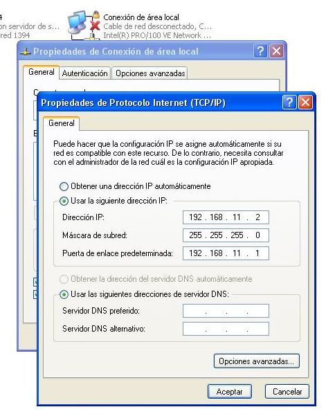
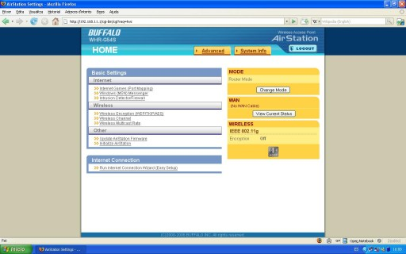
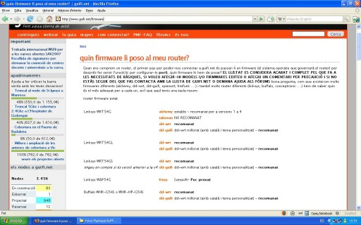
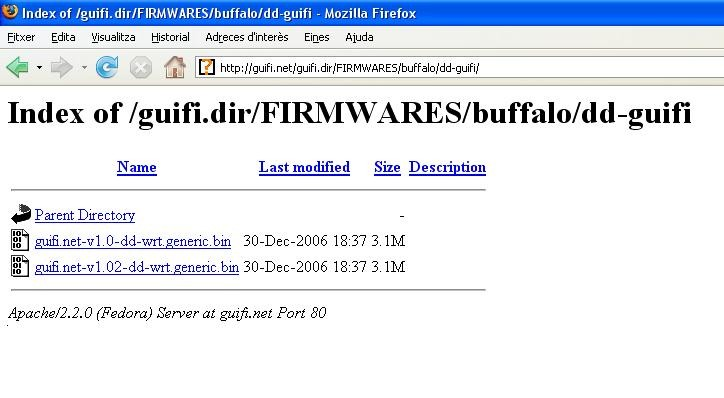



## Objectius

{: .lead}
En aquest pas veurem com preparar el nostre router per tal de poder-nos connectar a la xarxa de guifi.net. En el primer cas veurem com modificar un Buffalo WHR-G54S ja que, si hem seguit la primera part de la guia, és el que hem especificat a tot arreu. En el segon cas veurem com modificar un Linksys WRT-54GL ja que probablement és el més conegut i usat per aquest tipus de coses. Per últim, buscarem un punt d'accés per conectar-nos a la xarxa Guifi.net.

{: .alert .alert-info }
**Abans de començar** Com que hem de treballar sobre el nostre router, el treiem de la caixa estanca i anem a un lloc més còmode per facilitar el treball.

{: .alert .alert-danger }
**Avís important** La modificació del firmware comporta uns riscos, tals com la inutilització del router si no es realitza correctament. Es aconsellable que aquest pas es realitzi saben els que es fa i seguint al peu de la lletra els passos que venen a continuació. En cas de dubte i/o por a inutilitzar el router deixeu que algú amb experiència en el tema us doni un cop de mà. Els autors de la guia no es responsabilitzen dels danys que pugui patir el vostre router.

## Procediments per al Buffalo WHR-G54S

Connectem el router amb el transformador i l'endollem. Agafem el cable de xarxa i el connectem, un extrem a l'ordinador i l'altre a un dels ports que té el router (en aquest cas el primer).

{: .text-center}
{: .img-responsive .img-thumbnail}

Ara hem de configurar l'interfície de xarxa del nostre ordinador per tal de poder comunicar-nos amb el router. Per això anem a l'apartat ***Conexiones de red*** del Windows, que trobarem al Panel de control.

{: .text-center}
{: .img-responsive .img-thumbnail}

Veurem varies icones, però només ens interessa la ***Conexión de area local***. Cliquem amb el botó dret del ratolí sobre de l'icona i seleccionem ***Propiedades***.

{: .text-center}
{: .img-responsive .img-thumbnail}

Dins de les *Propiedades de Conexión de area local*, seleccionem ***Protocolo Internet (TCP/IP)*** i cliquem ***Propiedades*** un altre cop.

{: .text-center}
"){: .img-responsive .img-thumbnail}

Aquí seleccionarem ***Usar la siguiente dirección IP*** i escriurem els següents camps:

- Dirección IP: 192.168.11.2
- Mascara de subred: 255.255.255.0
- Puerta de enlace: 192.168.11.1

{: .text-center}
{: .img-responsive .img-thumbnail}

Després cliquem ***aceptar*** i finalment ***cerrar***. En aquest punt, si teniu Windows XP, hauríeu d'observar un núvol informatiu a la part inferior dreta, informant-vos de que s'ha establert una connexió de xarxa.

{: .text-center}
{: .img-responsive .img-thumbnail}

Ara, si obrim el navegador web i entrem l'adreça `192.168.11.1`, ens apareixerà la pantalla inicial de configuració del router.

{: .text-center}
{: .img-responsive .img-thumbnail}

Tot i que aquest router disposa d'un apartat per actualitzar el firmware a través del web, no ens serveix, ja que els routers Buffalo tenen el firmware encriptat i això impedeix actualitzar el router si no és amb un firmware del fabricant.

Per aquest motiu farem servir un aplicatiu anomenat TFTP. Afortunadament no hem d'instal·lar cap programa ja que el Windows XP ja disposa del protocol TFTP de sèrie.

Abans però, necessitem descarregar el firmware que volem posar al nostre router.

Si anem a la pàgina [www.guifi.net/firmware][firmware] ens donarà unes recomanacions depenent del router que tinguem.

[firmware]: http://www.guifi.net/firmware "Pàgina d'informació dels firmwares"

{: .text-center}
{: .img-responsive .img-thumbnail}

En aquest cas (router Buffalo WHR-G54S) ens recomanen el DD-guifi o el DD-WRT. Triarem el DD-guifi i clicarem a l'enllaç. Ara ens apareixerà la pàgina amb els firmwares.

{: .text-center}
{: .img-responsive .img-thumbnail}

Clicarem a la versió més nova (guifi.net-v1.02-dd-wrt.generic.bin) i el guardarem al disc.

{: .text-center}
{: .img-responsive .img-thumbnail}

---


