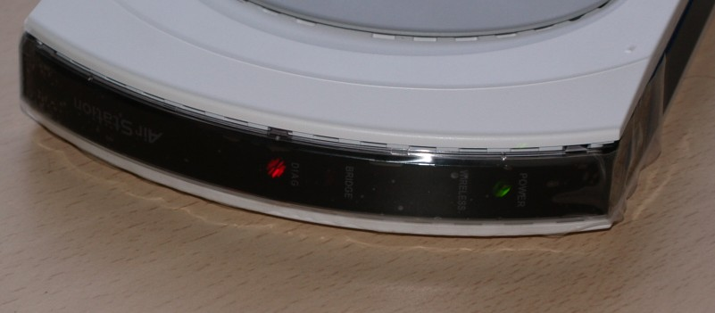



## Objectius

{: .lead }
Ara que ens hem baixat el firmware, hem connectat el router i hem configurat la connexió de xarxa, ja ho tenim tot apunt per modificar-lo.

Com hem dit, els Buffalo necessiten ser actualitzats a través de TFTP. Per poder utilitzar-ho, anem a ***inicio*** &gt; ***ejecutar...*** escrivim `cmd` i cliquem ***Aceptar.*** Ens apareixerà una finestra de terminal.

{: .text-center}
{: .img-responsive .img-thumbnail}

Per poder veure l'estat de la connexió entre l'ordinador i el router durant els següents passos escrivim `ping 192.168.11.1 -t` a la finestra del terminal i premem *retorn* al teclat. Això ens anirà mostrant si hi ha resposta o no des de el router.

{: .text-center}
{: .img-responsive .img-thumbnail}

Ara obrim un altre terminal, anem a ***inicio*** & ***ejecutar...*** entrem `cmd` i cliquem ***Aceptar***. En aquest cas però anem a la carpeta on tenim guardat el firmware que ens hem baixat.

Com mostra la següent foto, ens trobem a la carpeta que conte el firmware *guifi.net-v1.02-dd-wrt.generic.bin*.

{: .text-center}
{: .img-responsive .img-thumbnail}

En aquesta nova finestra de terminal escrivim la següent comanda

Però no premem retorn encara!!!
{: .text-danger}

```
tftp -i 192.168.11.1 PUT guifi.net-v1.02-dd-wrt.generic.bin
```

{: .text-center}
{: .img-responsive .img-thumbnail}

Tot seguit, desconnectem el cable de corrent del nostre router.

{: .text-center}
{: .img-responsive .img-thumbnail}

Veurem que el primer terminal ens informa de que hi ha un *Error de hardware* a part de un missatge informatiu a la part inferior dreta que diu que el cable de xarxa està desconnectat.

{: .text-center}
{: .img-responsive .img-thumbnail}

Ara bé la part més complicada. **No us preocupeu si no us surt a la primera, és normal**. El pas consisteix en connectar el router a la corrent un altre cop i quan s'apaguin totes les quatre llumetes del router situades al darrere <i>premer retorn</i> al terminal on hem escrit allò de `tftp -i 192.168.11.1 PUT gufi.net-v1.02-dd-wrt.generic.bin.` Si tot va bé al cap d'uns segons apareixerà el missatge: ***Transferencia terminada: XXXXXXXX bytes en X segundos, XXXXX bytes/s***

Sinó apareixerà el missatge: ***Tiempo de espera agotado.***

{: .text-center}
{: .img-responsive .img-thumbnail}

Si no ha funcionat torneu a repetir la operació, prepareu la comada tftp en una terminal i desconecteu el router de la corrent. Al cap d'uns segons torneu a connectar el router a la corrent i premeu retorn al teclat. Així fins que tingueu èxit.

{: .alert .alert-info }
**Informatiu** si porteu varis intents fallits proveu la següent comanda, la qual registra l'adreça MAC del router al nostre ordinador i fa que pugui detectar l'aparell més ràpidament. \\
`arp -s 192.168.11.1 MAC-DEL-ROUTER`

{: .text-center}
{: .img-responsive .img-thumbnail}

Ara el router començarà a fer coses rares, notareu que el terminal que mostra l'estat de la connexió es connecta i es desconnecta.

{: .text-center}
{: .img-responsive .img-thumbnail}

A part també veureu que s'engeguen i es paren les llums del davant del router.

{: .text-center}
{: .img-responsive .img-thumbnail}

Tranquils, tot això és normal, el firmware que hem posat al router s'està instal·lant i per tant necessita reiniciar-se varis cops.

Al cap d'una estona veureu que el terminal que mostra l'estat de la connexió mostra tota l'estona ***Respuesta desde 192.168.11.1: Bytes32 tiempo&lt;1m TTL=64.***

{: .text-center}
{: .img-responsive .img-thumbnail}

Això vol dir que el router ja està llest per tornar-lo a col·locar i connectar al lloc definitiu que hem muntat al primer punt.
