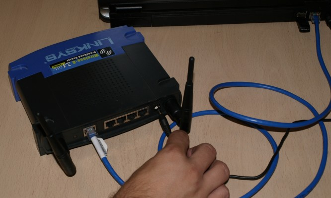



## Procediments per al Linksys WRT-54GL

Connectem el router amb el transformador i l'endollem. Agafem el cable de xarxa i el connectem, un extrem a l'ordinador i l'altre a un dels ports que té el router (en aquest cas el primer).

{: .text-center}
{: .img-responsive .img-thumbnail}

Ara hem de configurar l'interfície de xarxa del nostre ordinador per tal de poder comunicar-nos amb el router. Per això anem a l'apartat ***conexiones de red*** del windows, que trobarem al Panel de control.

{: .text-center}
{: .img-responsive .img-thumbnail}

Veurem varies icones, però només ens interessa la ***Conexión de area local***. Cliquem amb el botó dret del ratolí sobre de l'icona i seleccionem ***Propiedades***.

{: .text-center}
{: .img-responsive .img-thumbnail}

Dins de les *Propiedades de Conexión de area local*, seleccionem ***Protocolo Internet (TCP/IP)*** i cliquem ***Propiedades*** un
altre cop.

{: .text-center}
"){: .img-responsive .img-thumbnail}

Aquí seleccionarem ***Usar la siguiente dirección IP*** i escriurem els següents camps:

- Dirección IP: 192.168.1.2
- Mascara de subred: 255.255.255.0
- Puerta de enlace: 192.168.1.1

{: .text-center}
{: .img-responsive .img-thumbnail}

Després cliquem ***aceptar*** i finalment ***cerrar***. En aquest punt, si teniu Windows XP, hauríeu d'observar un núvol informatiu a la part inferior dreta, informant-vos de que s'ha establert una connexió de xarxa.

{: .text-center}
{: .img-responsive .img-thumbnail}

Ara, si obrim el navegador web i entrem l'adreça `192.168.1.1`, ens apareixerà la pantalla inicial de configuració del router.

{: .text-center}
{: .img-responsive .img-thumbnail}

Aquests routers disposen d'un apartat per actualitzar el firmware a través del web. A diferència del Buffalo, aquest no estan encriptats i per tant podem fer servir aquesta utilitat per modificar el firmware.

{: .text-center}
{: .img-responsive .img-thumbnail}

Abans però, necessitem descarregar el firmware que volem posar al nostre router. Si anem a la pàgina [www.guifi.net/firmware][firmware] ens donarà unes recomanacions depenent del router que tinguem.

[firmware]: http://www.guifi.net/firmware "Pàgina d'informació dels firmwares"

{: .text-center}
{: .img-responsive .img-thumbnail}

En aquest cas (WRT-54GL) ens recomanen el DD-guifi o el DD-WRT. Triarem el DD-guifi i clicarem a l'enllaç. Ara ens apareixerà la pàgina amb els firmwares.

{: .text-center}
{: .img-responsive .img-thumbnail}

Clicarem a la versió més nova (guifi.net-v1.02-dd-wrt.wrt54GL.bin) i el guardarem al disc.

{: .text-center}
{: .img-responsive .img-thumbnail}

---



