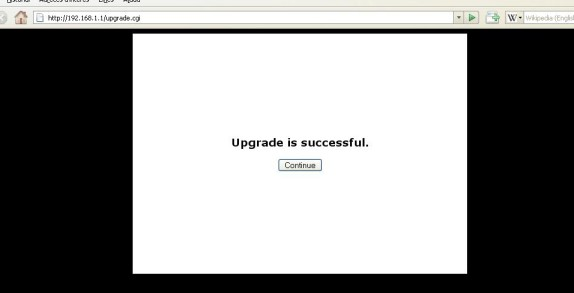
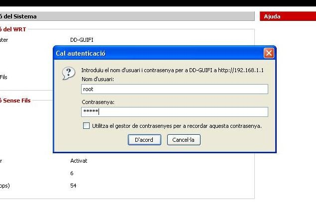



{: .lead }
Ara que ens hem baixat el firmware, hem connectat el router i hem configurat la connexió de xarxa, ja ho tenim tot apunt per modificar-lo.

Per entrar a la configuració escrivim `192.168.1.1` al navegador web i entrem el nom *d'usuari* `admin` i la *contrasenya* `admin`.

Només hem d'anar a l'aparta ***Administration*** & ***Firmware Update***, clicar a ***Navega*** i seleccionar l'arxiu de firmware
que ens hem baixat prèviament.

{: .text-center}
{: .img-responsive .img-thumbnail}

Un cop tot apunt cliquem el botó ***upgrade***. A partir d'aquest moment el router començarà a carregar el nou firmware.

{: .text-center}
{: .img-responsive .img-thumbnail}

Un cop ha acabat de carregar l'arxiu de firmware, ens informarà amb un missatge a la pantalla del navegador. De moment no heu de prémer el botó *Continue* ja que de moment només s'ha carregat el firmware però no s'ha instal·lat i per tant no faria res si el premeu.

{: .text-center}
{: .img-responsive .img-thumbnail}

Ara el router començarà a fer coses rares, veureu que s'engeguen i es paren les llums frontals.

{: .text-center}
{: .img-responsive .img-thumbnail}

Tranquils, això és normal, el firmware que hem posat al router s'està instal·lant i per tant necessita reiniciar-se varis cops.

Ens esperem un minutet i llavors cliquem ***Continue***.

A partir d'aquí, el router ja està llest per tornar-lo a col·locar i connectar al lloc definitiu que hem muntat al primer punt.

Si ara obrim el navegador web i escrivim `192.168.1.1` ens apareixerà una pàgina diferent a la que havíem vist anteriorment. Aquesta és la pàgina principal del nou firmware (el DD-guifi).

{: .text-center}
{: .img-responsive .img-thumbnail}

Ara hem d'anar a l'apartat que s'anomena **Estat** que trobareu a la part superior dreta.

{: .text-center}
{: .img-responsive .img-thumbnail}

Un cop clicat, us demanarà autentificar-vos per accedir al router. Haurem d'escriure el nom *d'usuari* `root` i la *contrasenya* `admin`.

{: .text-center}
{: .img-responsive .img-thumbnail}

Si hem realitzat correctament la validació de l'usuari, ens apareixerà la pantalla d'Estat del router, on trobarem 3 noves pestanyes: **Router**, **Lan** i **Sense fils**.

{: .text-center}
{: .img-responsive .img-thumbnail}

Ara hem de clicar a la pestanya que diu **Sense fils**

{: .text-center}
{: .img-responsive .img-thumbnail}

Trobarem un botó a la part inferior esquerra anomenat **Survey**, que ens servirà per buscar els punts d'accés inal·làmbrics propers al nostre router.

{: .text-center}
{: .img-responsive .img-thumbnail}

Cliquem al botó **Survey** i ens apareixerà la següent pantalla a on se'ns presenta diversa informació en una espècie de graella anomenada **Llistat d'AP's**.

{: .text-center}
{: .img-responsive .img-thumbnail}

Dins d'aquesta nova finestra, hem de buscar un punt d'accés que comensi per **"guifi.net-NOMUBICACIÓ"** i que els paràmetres de **RSSI** i **NOISE** siguin els recomanats. Entenem per valors recomanats els valors compresos entre el ***Valors aconsellats*** i el ***Valor mínim aconsellable*** de la taula següent:

{: .table .table-bordered }
| Camp | Valor aconsellat | Valor mínim aconsellable |
|:------:|:------:|:------:|
| RSSI   | ~ -75  | > -85  |
| NOISE  | -100   | < -95  |

{: .alert .alert-info }
**Atenció** cal tenir en compte que els valors negatius del RSSI poden portar a la confusió, ja que al ser en escala negativa, un -75 seria més gran (i millor) que un -85. Igual passa amb el NOISE, que ha de ser com més proper a -100 millor.

En el nostre cas, el punt d'accés seleccionat (AP) es "guifi.net-TaradellRadioAP" perquè obtenim uns valors de RSSI de -59 i NOISE de -93.

{: .text-center}
{: .img-responsive .img-thumbnail}

En cas que obtenim uns valors molt dolents (RSSI ~ -90 i/o NOISE ~ -80) o no trobar cap AP de guifi.net, haurem de re-orientar l'antena i clicar on hi ha el botó de **Actualitzar**.

{: .text-center}
{: .img-responsive .img-thumbnail}

Un cop ja sabem a on connectar, anem a la web de Guifi.net a donar d'alta el nostre node per tal de situar el nostre node i realitzar la configuració del router.

### Què hem vist? ###

En aquest fragment de la guia hem après a:

1. Descarregar el firmware per al nostre router de la pàgina de guifi.net.
2. Modificar el firmware del router.
3. Buscar un punt d'accés per connectar-se a la xarxa guifi.net.

---


