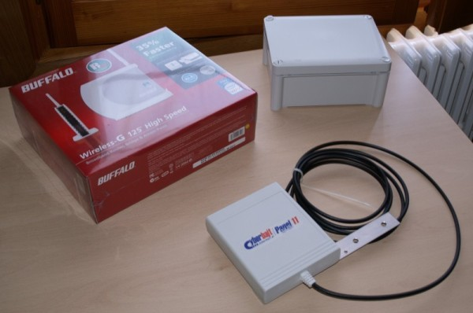
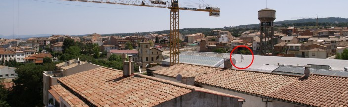
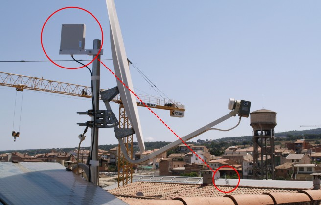
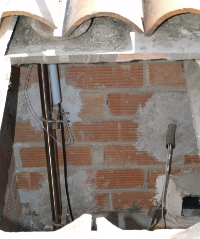
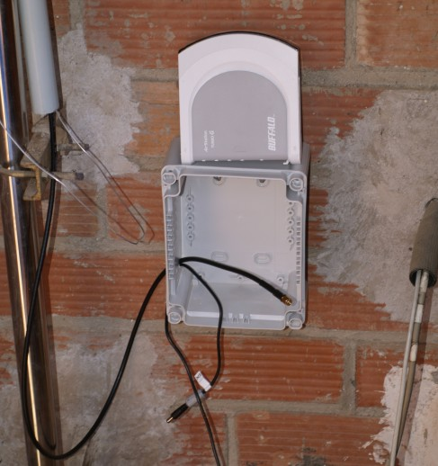
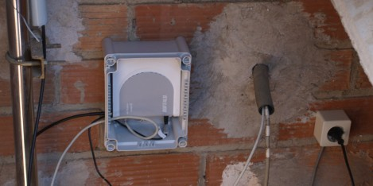



## Objectius

{: .lead }
Veurem a través d'una instal·lació real com s'ha de muntar l'antena, el router, els cables de corrent i de xarxa i quin és el millor lloc per posar tots els aparells.

Agafam els tres elements principals de la nostre instal·lació, els quals són el router, l'antena+cable i una caixa estanca.

{: .text-center}
{: .img-responsive .img-thumbnail}

Anem cap al lloc on tenim previst fer la instal·lació, que normalment serà la teulada per tractar-se del punt més alt de la casa i on podrem obtenir una millor visió entre la nostre antena i el node on volem connectar (SuperNode). De manera visual, busquem la ubicació del SuperNode per tal de saber cap a quina direcció muntar la nostre antena.

{: .text-center}
{: .img-responsive .img-thumbnail}

{: .alert .alert-info }
**Molt important** a l'hora d'escollir una ubicació del nostre node, es **molt important** i **imprescindible** que veiem l'antena on hem d'anar a connectar. La línia de visió entre la nostre antena i l'antena on connectarem ha de estar completament lliure d'obstacles i/o impediments, ja que en cas contrari es complicaria la connexió o inclús no podríem connectar.

Ara que ja sabem aon col·locarem la nostre antena, la muntem utilitzant els accessoris que ja porten subministrats amb l'antena. En el nostre cas, hem aprofitat el màstil de l'antena parabòlica ja que tenia visió directe i era el punt més alt.

{: .text-center}
{: .img-responsive .img-thumbnail}

Seguidament busquem una ubicació per col·locar la caixa estanca per al router i protegir-lo de les inclemències del temps. Tenint en compte que la distància entre l'antena i el router pot ser com a molt de 3 metres, hem de buscar un lloc pròxim. En el nostre cas disposem d'un espai sota teulada just a sota del màstil de l'antena.

{: .text-center}
{: .img-responsive .img-thumbnail}

Passem els cables cap a dins de la caixa per conectar-los posteriorment al router. Si fa falta, fem uns forats a la caixa estanca, però tenint en compte que els hem de fer a la part inferior perquè no hi entri l'aigua. En el nostre cas, hem fet els forats al lateral de la caixa ja que la instal·lació es a sota teulada.

{: .text-center}
{: .img-responsive .img-thumbnail}

Connectem els cables (cable de xarxa, connector d'antena i cable d'alimentació) i posem el router a dins de la caixa.

{: .text-center}
{: .img-responsive .img-thumbnail}

Ara ja només ens falta posar la tapa de la caixa estanca i ja estem.

### Què hem vist?
En aquest fragment de la guia hem après a:

1. Buscar una bona ubicació per a l'antena del nostre node.
2. Fer la instal·lació física del nostre node.

---



