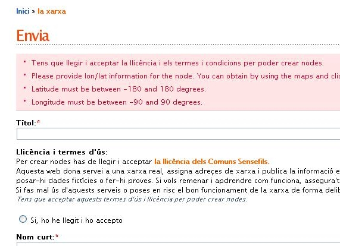

{: .lead }
Ara que ja tenim el nostre usuari, podem anar per crear el nostre node. El node no és res més que la informació d'on farem l'enllaç, cap a on ens connectarem i de quina manera.

---

Per poder crear el node anem a l'apartat de ***mapes***, que trobarem al menú superior.

{: .text-center}
{: .img-responsive .img-thumbnail}

{: .alert .alert-info }
**Important!** Abans d'anar a l'apartat de mapes ens hem d'assegurar que hem entrat com a usuari, si no és així, escrivim el nostre nom d'usuari i contrasenya i premem el botó ***entreu.***

{: .text-center}
{: .img-responsive .img-thumbnail}

Després de clicar a mapes, ens apareixerà la següent pàgina. Aquesta pàgina ens mostra tots els enllaços, punts d'accés, clients, que té la xarxa guifi.net.

{: .text-center}
{: .img-responsive .img-thumbnail}

El que hem de fer és localitzar la situació geogràfica del lloc on volem muntar el node ( és a dir, la teulada de casa nostre :P ). Per anar més ràpids podem seleccionar el nom del nostre poble al desplegable que hi ha a l'esquerra.

{: .text-center}
{: .img-responsive .img-thumbnail}

Anem fent zoom fins que col·loquem l'estrelleta de color vermell sobre el lloc on anirà el node (la teulada...).

{: .text-center}
{: .img-responsive .img-thumbnail}

Un cop tenim localitzada la situació cliquem a l'enllaç que hi ha a sota del mapa, que diu ***afegir un node on hi ha l'estrella.*** Això ens portarà ala següent pàgina.

{: .text-center}
{: .img-responsive .img-thumbnail}

En aquesta pàgina hem d'omplir les dades del nostre node.

- *Títol*: El nom del nostre node.
- *Nom curt*: El nom curt per accedir directament a la pàgina d'informació del node des de guifi.net.
- *Contacte*: correu electrònic de contacte, de la persona responsable del node (OPCIONAL).
- *Barri,zona*: Lloc on està situat el node (OPCIONAL).
- *Longitud i Latitud*: Les coordenades geogràfiques (NO CAL TOCAR RES!!!, ja les ha agafat del mapa anterior).
- *Descripció de la zona*: La direcció d'on hi ha el node (OPCIONAL).
- *Alçada de l'antena*: Alçada aproximada de l'antena des del terra (OPCIONAL).
- *Tens intenció de que sigui un node sempre connectat?*: Triem l'opció que més us convingui (Habitualment SI).
- *Cos*: Aquí podeu posar altres dades informatives de que disposarà el node (OPCIONAL).

Un cop entrades totes les dades podem prémer el botó de ***previsualitzar***, per veure com quedaran les dades, o el botó ***Envieu***, per guardar les dades definitivament.

{: .alert .alert-warning }
**Important** Si feu un *previsualitzar* , assegureu-se de fer un *envieu*  per guardar les dades després!!.

{: .text-center}
{: .img-responsive .img-thumbnail}

Després de prémer el botó *Envieu* , se'ns obrirà la pàgina **informació del node**, on es mostren les dades del nostre node, la situació geogràfica i *els trastos que té associat*.

{: .text-center}
{: .img-responsive .img-thumbnail}

### Què hem vist?

En aquest fragment de la guia hem après a:

1. Donar d'alta un nou node a la xarxa de guifi.net

