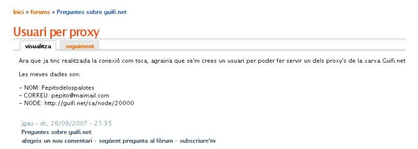

{: .lead }
En aquest últim apartat t'ensenyarem a configurar el teu navegador per tal de poder accedir a internet a través dels diferents proxy's que hi ha a la xarxa Guifi.net.

---

Primer de tot hem d'anar als [fòrums de la pàgina Guifi.net][forum] i per mitjà d'un nou missatge, demanar que ens crein l'usuari per poder accedir a Internet. Les dades que hem de deixar són:

[forum]: http://guifi.net/ca/forum/126 "Fòrums de Guifi.net"

- Nom real
- adreça de correu electrònic
- El nom del nostre node i/o el número de node

{: .text-center}
{: .img-responsive .img-thumbnail}

Ara només ens falta configurar el nostre navegador preferit per poder sortir cap a Internet.

Escull el teu navegador per veure les instruccions:

- [Internet Explorer](proxy-ie.html)
- [Mozilla Firefox](proxy-mf.html)

### Què hem vist

En aquest fragment de la guia hem après a:

1. Demanar l'alta d'usuari per als proxys de la xarxa Guifi.net.
