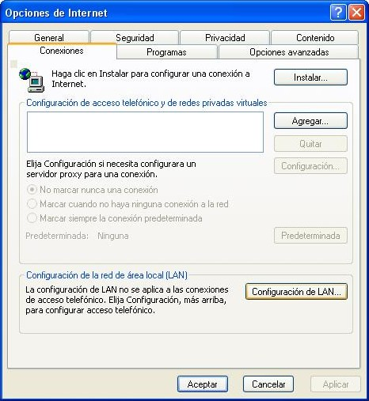



***Objectius***

En aquest últim apartat t'ensenyarem a configurar el teu navegador per tal de poder accedir a internet a través dels diferents proxy's que hi ha a la xarxa Guifi.net.

Primer de tot hem d'anar als [fòrums de la pàgina Guifi.net][forum] i per mitjà d'un nou missatge, demanar que ens crein l'usuari per poder accedir a Internet. Les dades que hem de deixar són:

[forum]: http://guifi.net/ca/forum/126 "Fòrums de Guifi.net"

- Nom real
- adreça de correu electrònic
- El nom del nostre node i/o el número de node

{: .text-center}
{: .img-responsive .img-thumbnail}

Ara només ens falta configurar el nostre navegador preferit per poder sortir cap a Internet.

***Procediments per al Internet Explorer***

Obrim l'Internet Explorer.

{: .text-center}
{: .img-responsive .img-thumbnail}

Cliquem a l'apartat del menú ***Herramientas & Opciones de Internet***

{: .text-center}
{: .img-responsive .img-thumbnail}

A la finestra que s'obra, anem a la pestanya de ***Conexiones***

{: .text-center}
{: .img-responsive .img-thumbnail}

Cliquem al butó de ***Configuracón del Lan*** el qual ens obrirà una nova finestre

{: .text-center}
{: .img-responsive .img-thumbnail}

A l'apartat *servidor proxy* marquem el quadre que té com a text "Usar un servidor proxy para su LAN" el qual activarà uns quadres de text.

{: .text-center}
{: .img-responsive .img-thumbnail}

Depenent la nostra ubicació, haurem d'omplir els següents quadres amb la informació que trobareu a l'apartat **Internet a través d'un proxy**, que hi ha a la següent web:

[http://guifi.net/ca/node/2413/view/services][proxy-guifi]

[proxy-guifi]: http://guifi.net/ca/node/2413/view/services "Llista de proxys de la xarxa Guifi.net"

{: .text-center}
{: .img-responsive .img-thumbnail}

No us oblideu de marcar el quadre que posa "Usar el mismo servidor proxy para todos los protocolos" que trobaras a la finestra que obra el botó "Opciones avanzadas...",com es veu a la següent foto.

{: .text-center}
{: .img-responsive .img-thumbnail}

Un cop tinguem la informació escrita, anem clicant ***Aceptar*** a les diferent finestres que hem anat obrint. Si tot està bé, si escrivim una pàgina qualsevol de Internet (p. ex. www.google.com) ens hauria d'apareixer un quadre on ens demana un nom d'usuari i una contrassenya.

Els omplim amb l'usuari i contrassenya que ens han facilitat als fòrums de Guifi.net (tipiciament, com a usuari "*nom.cognomdelapersona*" i de contrassenya "*nomdelapersona*" ).

{: .text-center}
{: .img-responsive .img-thumbnail}

I ara, a navegar!!!.
