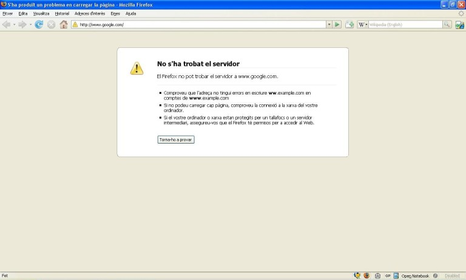
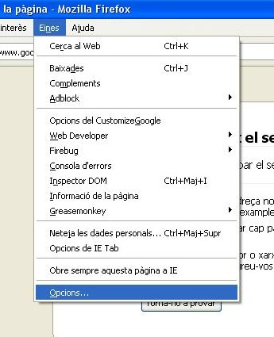
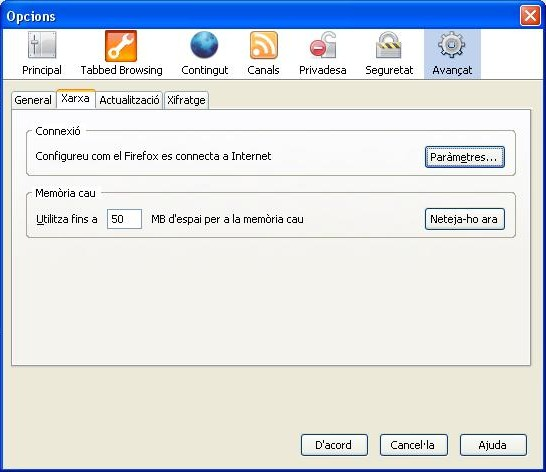
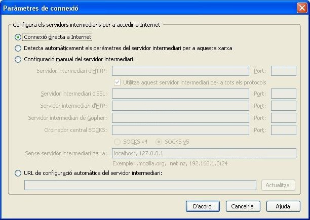
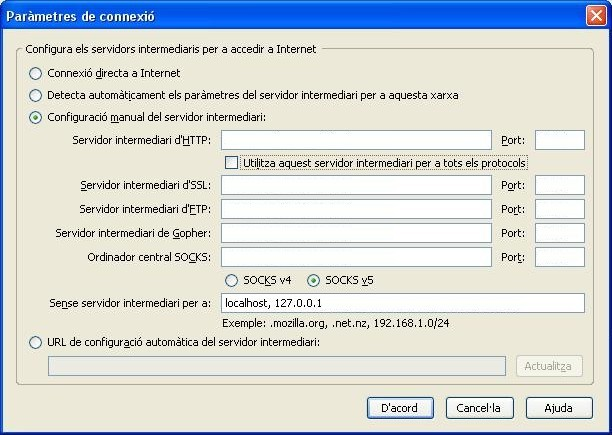
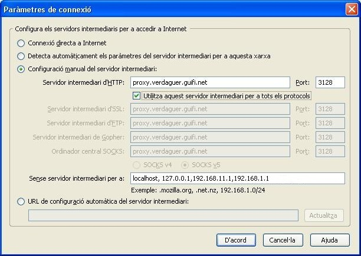
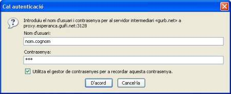



***Procediments per al Mozilla Firefox***

Obrim el Mozilla Firefox.

{: .text-center}
{: .img-responsive .img-thumbnail}

Cliquem a l'apartat del menú ***Eines*** & ***Opcions***

{: .text-center}
{: .img-responsive .img-thumbnail}

A la finestra que s'obra, cliquem a l'icona de ***Avançat*** i després anem a la pestanya de ***Xarxa***

{: .text-center}
{: .img-responsive .img-thumbnail}

Cliquem al butó de ***Paràmetres...***  el qual ens obrirà una nova finestre

{: .text-center}
{: .img-responsive .img-thumbnail}

Marquem l'opció que té com a text "Configuració manual del servidor intermediari" el qual activarà uns quadres de text.

{: .text-center}
{: .img-responsive .img-thumbnail}

Depenent la nostra ubicació, haurem d'omplir els següents quadres amb la informació que trobareu a l'apartat **Internet a través d'un proxy**, que hi ha a la següent web:

[http://guifi.net/ca/node/2413/view/services][proxy-guifi]

[proxy-guifi]: http://guifi.net/ca/node/2413/view/services "Llista de proxys de la xarxa Guifi.net"

{: .text-center}
{: .img-responsive .img-thumbnail}

No us oblideu de marcar el quadre que posa "Utilitzar aquest servidor intermediari per a tots els protocols" com es veu a la següent foto.

{: .text-center}
{: .img-responsive .img-thumbnail}

Un cop tinguem la informació escrita, anem clicant ***D'acord*** a les diferent finestres que hem anat obrint. Si tot està bé, si escrivim una pàgina qualsevol de Internet (p. ex. www.google.com) ens hauria d'apareixer un quadre on ens demana un nom d'usuari i una contrassenya.

Els omplim amb l'usuari i contrassenya que ens han facilitat als fòrums de Guifi.net (tipiciament, com a usuari "*nom.cognom-delapersona*" i de contrassenya "*nom-delapersona*" ).

{: .text-center}
{: .img-responsive .img-thumbnail}

I ara, a navegar!!!.

***Què hem vist***

En aquest fragment de la guia hem après a:

1. Demanar l'alta d'usuari per als proxys de la xarxa Guifi.net.
2. Configurar el nostre navegador web per tal d'utilitzar els proxys de la xarxa Guifi.net.

