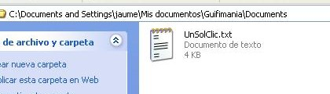
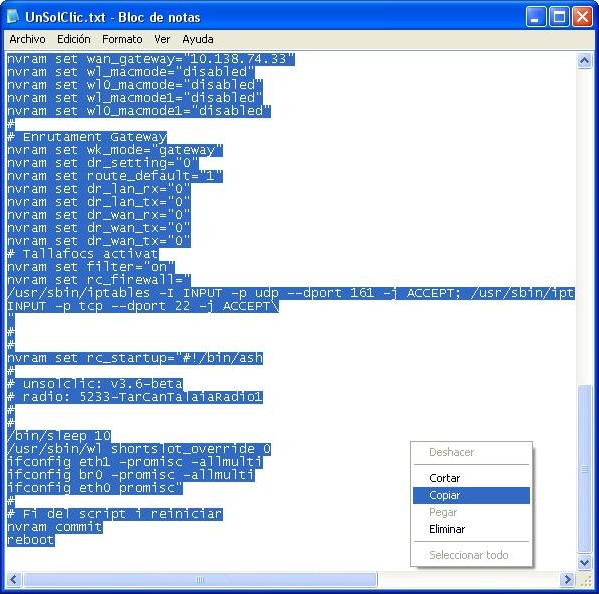
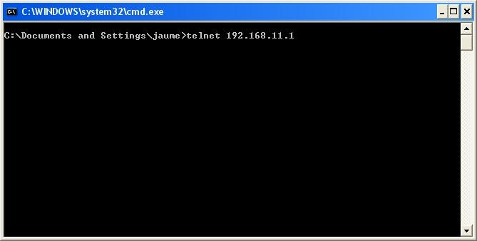
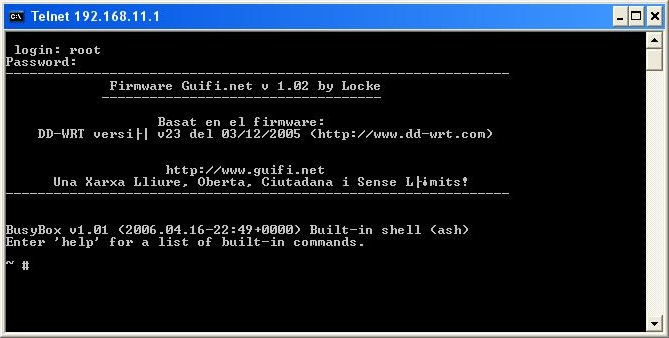
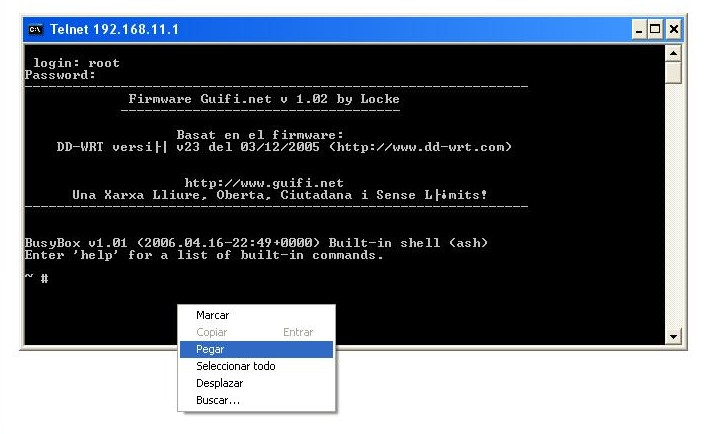
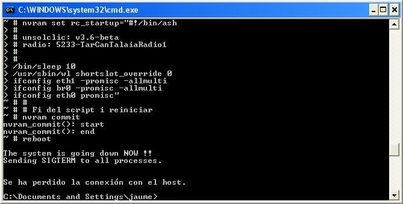
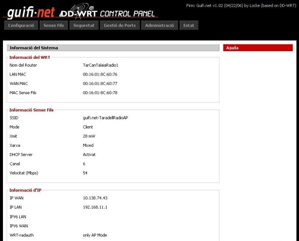
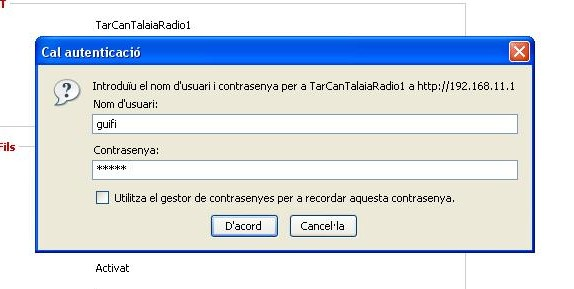

{: .lead }
En aquest pas, configurarem el nostre router amb els paràmetres que hem obtingut a Guifi.net per tal de conectar-nos al punt d'accés que anteriorment hem sel·leccionat.

---

### Procediments

Per fer-ho utilitzarem l'unsolclic, que en el pas anterior hem guardat en un arxiu de text.
Obrim l'arxiu que hem guardat anteriorment.

{: .text-center}
{: .img-responsive .img-thumbnail}

Seleccionem tot el contingut i ho copiem.

{: .text-center}
{: .img-responsive .img-thumbnail}

Obrim un terminal (***inicio*** & ***Ejecutar...*** Escrivim `cmd` i premem ***Aceptar***) i escrivim:

- `telnet 192.168.11.1`, en el cas que sigui un router Buffalo WHR-G54S
- `telnet 192.168.1.1`, en el cas que sigui un router Linksys WRT-54GL

En el nostre cas, es tracta d'un router Buffalo.

{: .text-center}
{: .img-responsive .img-thumbnail}

Ens demanarà un login i un password, els quals són els mateixos que els de la web, `root` i `admin` consecutivament.

{: .text-center}
{: .img-responsive .img-thumbnail}

Ja estem connectats al router, el que hem de fer ara és enganxar el text de l'unsolclic a la terminal.

{: .text-center}
{: .img-responsive .img-thumbnail}

Començaran a aparèixer tot de línies de comanda, les quals configuren el router per deixar-lo apunt per connectar-se amb la xarxa de guifi.net.

{: .text-center}
{: .img-responsive .img-thumbnail}

Un cop ha acabat, si tornem a obrir el navegador web i entrem a `192.168.11.1` (en el cas del Linksys `192.168.1.1`) ens apareixerà un altre cop la pantalla d'inici, però ara amb totes les dades configurades.

{: .text-center}
{: .img-responsive .img-thumbnail}

Si volem veure o modificar qualsevol paràmetre ens demanarà un nom d'usuari i una contrasenya, aquestes ara són `guifi` com a nom d'usuari i `guifi` com a contrasenya.

{: .text-center}
{: .img-responsive .img-thumbnail}

Ja hem acabat!!! Ja tenim el nostre router Buffalo WHR-G54S o Linksys WRT-54GL apunt per connectar-se a la xarxa de Guifi.net. Per probar que estem connectats a la xarxa Guifi.net obrim el navegador i escrivim com a URL "http://www.guifi.net". Si ens apareix la pàgina de Guifi.net voldrà dir que hem realitzat correctament la connexió amb la xarxa. En cas contrari, si no la podem veure, haurem de repassar tots els passos de la guia, ja que segurament ens hem equivocat en algun lloc.

### Què hem vist?

En aquest fragment de la guia hem après a:

1. Conectar-nos per telnet al nostre router
2. Passar l'UnSolClic
3. Deixar el nostre router configurat i probar la connexió amb la xarxa Guifi.net.
