{: .lead }
Ara que ja tenim el node, hem de crear el trasto. Un trasto no és res més que la informació del router. A cada node i poden haver varis trastos, però per poder connectar-nos a la xarxa guifi.net només ens fa falta un trasto (el router que hem comprat), el qual enllaçarà amb el punt d'accés que tinguem més aprop.

---

### Procediments

Per poder donar d'alta el trasto premem el botó d'***afegeix*** que hi ha a l'apartat de **trastos**.

{: .text-center}
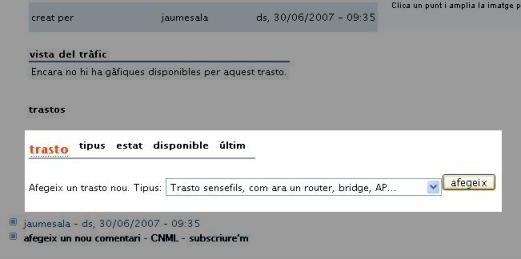{: .img-responsive .img-thumbnail}

Un cop dins se'ns presenta la pàgina **afegint un nou trasto a "nom-del-node"**, on haurem d'omplir les dades que se'ns demanen.

{: .text-center}
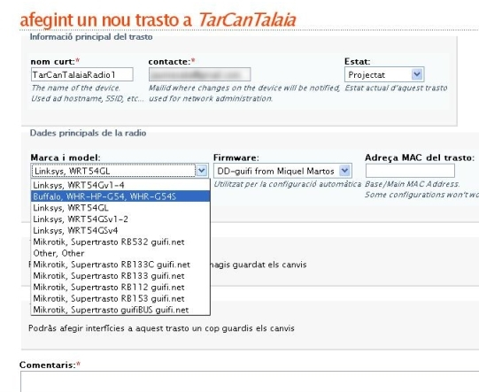{: .img-responsive .img-thumbnail}

- **Nom curt** El nom que li volem posar al trasto.
- **Contacte** El correu electrònic de la persona que s'encarrega del trasto.
- **Estat** Estat en que es troba el trasto (ara podem posar PROJECTAT, més endavant ja canviarem l'estat).
- **Marca i model** La marca i model de router (En aquest cas es tracta d'un router BUFFALO i el model és el WHR-G54S).
- **Firmware** El tipus de firmware que hi posarem (En aquest cas posarem el firmware DD-GUFI, que està basat en el DD-WRT).
- **Adreça MAC del trasto** El número identificatiu de l'adreça MAC del nostre router (habitualment en un adhesiu que es troba a la carcasa del router).
- **Comentaris** si es vol posar alguna informació concreta del router...

Un cop plena tota la informació premem el botó ***Guardar i continuar editant***.

{: .text-center}
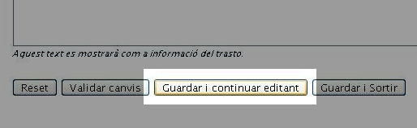{: .img-responsive .img-thumbnail}

Ara se'ns presenta la mateixa pàgina però amb unes opcions més per a editar. Aquestes opcions són les de la ràdio. Una ràdio no és res més que l'interfície wireless del nostre router, és a dir, la informació de l'antena que té el nostre aparell. Per poder afegir una ràdio premem al botó ***afegeix una ràdio***.

{: .text-center}
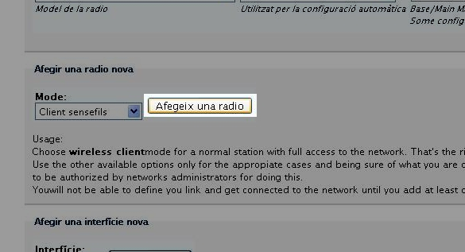{: .img-responsive .img-thumbnail}

Veureu que apareix una línia amb tot d'informació. Això no és res més que la descripció de l'antena que té el nostre router. No us estranyi que l'adreça MAC que apareix a la ràdio sigui diferent a la que heu entrat abans. Aquesta adreça MAC és la de l'antena del vostre router (MAC del trasto + 2).

{: .alert .alert-info }
**Informatiu** Un router sol tenir dos adreces MAC, una és la que controla tots els ports que té per cable i l'altre és la que controla la connexió inal·làmbrica. Al ser dos medis diferents es necessiten dos identificadors diferents.

{: .text-center}
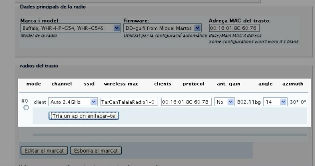{: .img-responsive .img-thumbnail}

Ara el que hem de fer és indicar amb quin punt d'accés (AP) volem enllaçar-nos. Per això premem el botó ***tria un AP on enllaçar-te***.

Aquí triarem el punt d'accés que anteriorment hem vist que era el que tenia millors valorsde RSSI i NOISE per conectar-se a la xarxa Guifi.net. En el nostre cas es tracta de &quot;TaradellRadioAP&quot;.

{: .text-center}
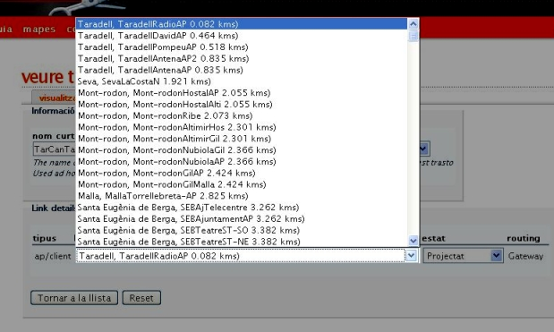{: .img-responsive .img-thumbnail}

Un cop seleccionat premem ***tornar a la llista***. Ara tornem a ser a la pàgina anterior, però ara el nostre ràdio ja té assignat un punt d'accés.

{: .text-center}
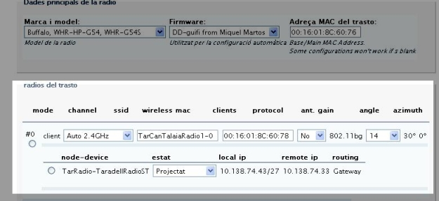{: .img-responsive .img-thumbnail}

Per acabar premem el botó ***guardar i sortir***, que ens portarà a la pàgina del nostre trasto.

{: .text-center}
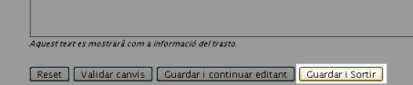{: .img-responsive .img-thumbnail}

L'últim pas que ens queda és el de l'unsolclic. L'unsolclic no és res més que un arxiu que ens genera la pàgina de guifi.net, per poder configurar el nostre router automàticament (Així no ens haurem d'estar barallant amb les pàgines de configuració del router durant hores... :P ).

Per poder generar l'unsolclic premem el botó que posa ***unsolclic*** de la part superior de la pàgina.

{: .text-center}
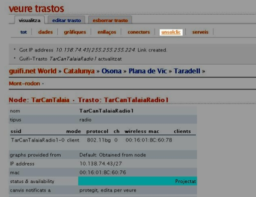{: .img-responsive .img-thumbnail}

Ja el tenim!!, ara només fa falta guardar aquestes dades per poder-les utilitzar en el següent pas.

{: .text-center}
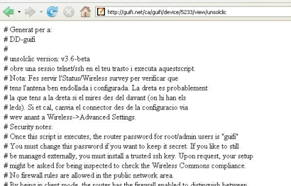{: .img-responsive .img-thumbnail}

Per això seleccionem tot el contingut de la pàgina, el copiem

{: .text-center}
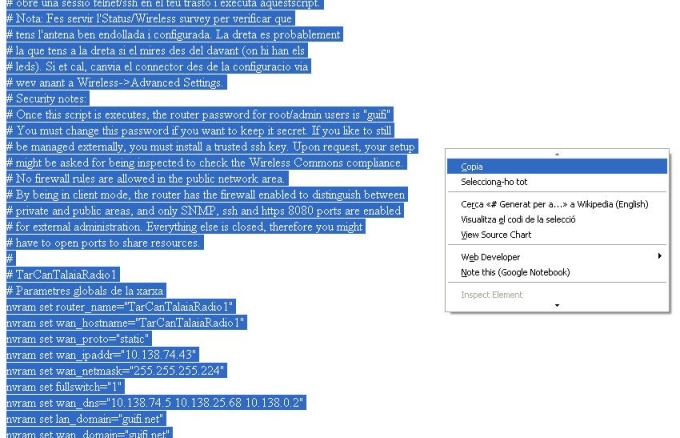{: .img-responsive .img-thumbnail}

i finalment el guardem en un arxiu de text.

{: .text-center}
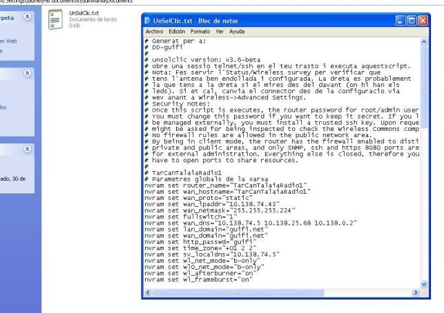{: .img-responsive .img-thumbnail}

Ja està!!!! El pròxim pas serà passar l'UnSolClic al nostre router per deixar-lo configurat correctament per connectar-nos a la xarxa Guifi.net.

### Què hem vist?

En aquest fragment de la guia hem après a:

1. Donar d'alta la ràdio que ens servei per enllaçar-nos a la xarxa
2. Generar l'unsolclic, el qual ens servirà per configurar el nostre router en el pròxim pas.
